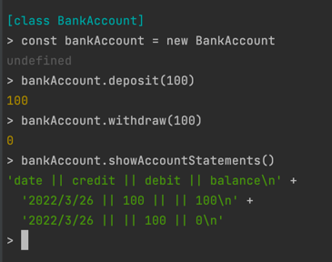

Run instructions:
1) Enter the bank directory and run npm install.
2) enter "node" in the console to enter the repl
3) enter ".load bankAccount.js" to require all neccessary files
4) create an instance of the BankAccount class and use any of the deposit, withdraw, or showAccountStatement methods

To run tests enter the bank directory and run "jest"

Approach:

* Followed TDD for making new features
* used dependency injection to keep flexibility for testing
* Extracted reused code like the date to a private method
* Tried to avoid magic numbers/variables in the code/tests

Code structure:

Code is separated out into a main bank account class and an accountStatements class.
This means that if the account statements were needed for a different class,
perhaps one that wanted to take data from all accounts to find the average transcation size.

code working in node:

